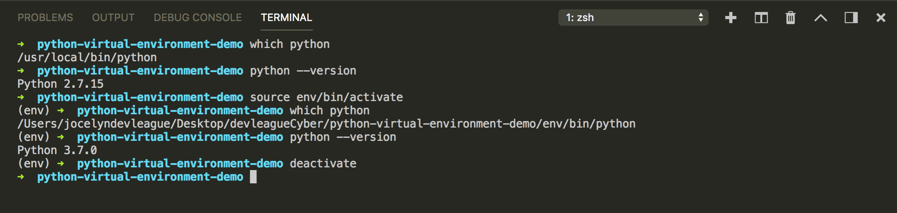

# Python Virtual Environments - Setup/Notes

[Python Virtual Environments: A Primer](https://realpython.com/python-virtual-environments-a-primer/)

[venv - Creation of Virtual Environments - Python Docs](https://docs.python.org/3/library/venv.html)

#### What is a Python Virtual Environment?

* An isolated environment for each project.
* Virtual environments are used to keep dependencies for different projects seperate. This is to ensure that projects using different versions of the same site packages (third-party libraries) don't interfere with each other.

#### Using Virtual Environments

* `mkdir <project name> && cd <project name>`
    * create a new project directory and cd into it
* `python3 -m venv env`
    * create a new virtual environment inside of the project directory
    * each folder contains:
        * bin: files that interact with the virtual environment
        * include: C headers that compile the Python packages
        * lib: a copy of the Python version along with a site-packages folder where each dependency is installed

* `source env/bin/activate`
    * activate your virtual environment to use the environment’s packages/resources in isolation

* `deactivate`
    * return to your normal shell and global python installation

